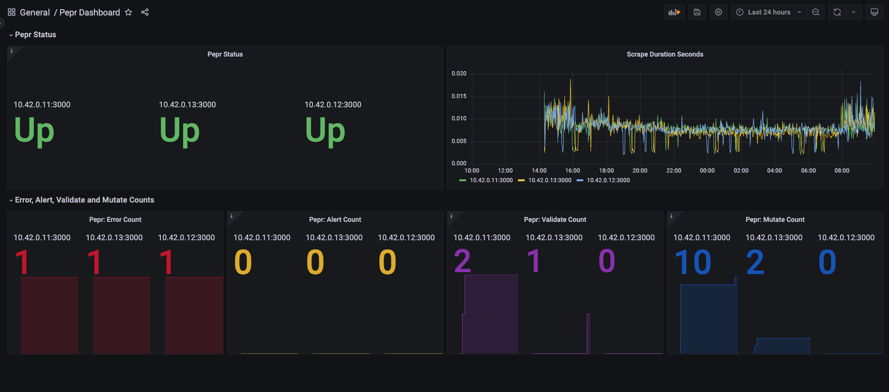

# Tutorial - Create a peppr Dashboard

## Introduction

This tutorial will walk you through the process of creating a dashboard to display your peppr metrics. This dashboard will present data such as the number of validation requests processed, the number of mutation requests that were allowed, the number of errors that were processed, the number of alerts that were processed, the status of the peppr pods, and the scrape duration of the peppr pods. This dashboard will be created using [Grafana](https://grafana.com/). The dashboard will display data from [Prometheus](https://prometheus.io/), which is a monitoring system that peppr uses to collect metrics.

This tutorial is not intended for production, but instead is intended to show how to quickly scrape peppr metrics. The [Kube Prometheus Stack](https://github.com/prometheus-community/helm-charts/tree/main/charts/kube-prometheus-stack) provides a starting point for a more production suitable way of deploying Prometheus in prod.

An example of what the dashboard will look like is shown below:



***Note:*** *The dashboard shown above is an example of what the dashboard will look like. The dashboard will be populated with data from your peppr instance.*

## Steps

### Step 1. Get Cluster Running With Your peppr Module Deployed

You can learn more about how to create a peppr module and deploy it in the [Create a peppr Module](010_create-peppr-module.md) tutorial. The short version is:

```bash
#Create your cluster
k3d cluster create

#Create your module
npx peppr init

#Change directory to your module that was created using `npx peppr init`
npx peppr  dev
kubectl apply -f capabilities/hello-peppr.samples.yaml

#Deploy your module to the cluster
npx peppr deploy
```


### Step 2: Create and Apply Our peppr Dashboard to the Cluster

Create a new file called grafana-dashboard.yaml and add the following content:

```yaml
apiVersion: v1
kind: ConfigMap
metadata:
  name: peppr-dashboard
  namespace: default
data:
  peppr-dashboard.json: |
    {
    "__inputs": [
      {
        "name": "DS_PROMETHEUS",
        "label": "Prometheus",
        "description": "",
        "type": "datasource",
        "pluginId": "prometheus",
        "pluginName": "Prometheus"
      }
    ],
    "__elements": {},
    "__requires": [
      {
        "type": "grafana",
        "id": "grafana",
        "name": "Grafana",
        "version": "9.1.6"
      },
      {
        "type": "datasource",
        "id": "prometheus",
        "name": "Prometheus",
        "version": "1.0.0"
      },
      {
        "type": "panel",
        "id": "stat",
        "name": "Stat",
        "version": ""
      },
      {
        "type": "panel",
        "id": "timeseries",
        "name": "Time series",
        "version": ""
      }
    ],
    "annotations": {
      "list": [
        {
          "builtIn": 1,
          "datasource": {
            "type": "grafana",
            "uid": "-- Grafana --"
          },
          "enable": true,
          "hide": true,
          "iconColor": "rgba(0, 211, 255, 1)",
          "name": "Annotations & Alerts",
          "target": {
            "limit": 100,
            "matchAny": false,
            "tags": [],
            "type": "dashboard"
          },
          "type": "dashboard"
        }
      ]
    },
    "editable": true,
    "fiscalYearStartMonth": 0,
    "graphTooltip": 0,
    "id": null,
    "links": [],
    "liveNow": false,
    "panels": [
      {
        "collapsed": false,
        "gridPos": {
          "h": 1,
          "w": 24,
          "x": 0,
          "y": 0
        },
        "id": 18,
        "panels": [],
        "title": "peppr Status",
        "type": "row"
      },
      {
        "datasource": {
          "type": "prometheus",
          "uid": "prometheus"
        },
        "description": "peppr pod status by pod",
        "fieldConfig": {
          "defaults": {
            "color": {
              "mode": "thresholds"
            },
            "mappings": [
              {
                "options": {
                  "0": {
                    "color": "red",
                    "index": 1,
                    "text": "Down"
                  },
                  "1": {
                    "color": "green",
                    "index": 0,
                    "text": "Up"
                  }
                },
                "type": "value"
              },
              {
                "options": {
                  "match": "empty",
                  "result": {
                    "color": "blue",
                    "index": 2,
                    "text": "?"
                  }
                },
                "type": "special"
              }
            ],
            "min": 0,
            "thresholds": {
              "mode": "absolute",
              "steps": [
                {
                  "color": "green",
                  "value": null
                },
                {
                  "color": "red",
                  "value": 80
                }
              ]
            }
          },
          "overrides": []
        },
        "gridPos": {
          "h": 8,
          "w": 12,
          "x": 0,
          "y": 1
        },
        "id": 14,
        "options": {
          "colorMode": "value",
          "graphMode": "none",
          "justifyMode": "auto",
          "orientation": "auto",
          "reduceOptions": {
            "calcs": [
              "last"
            ],
            "fields": "",
            "values": false
          },
          "text": {
            "titleSize": 16,
            "valueSize": 70
          },
          "textMode": "auto"
        },
        "pluginVersion": "9.1.6",
        "targets": [
          {
            "datasource": {
              "type": "prometheus",
              "uid": "prometheus"
            },
            "editorMode": "builder",
            "expr": "up{container=\"server\"}",
            "legendFormat": "{{instance}}",
            "range": true,
            "refId": "A"
          },
          {
            "datasource": {
              "type": "prometheus",
              "uid": "prometheus"
            },
            "editorMode": "builder",
            "expr": "up{container=\"watcher\"}",
            "hide": false,
            "legendFormat": "{{instance}}",
            "range": true,
            "refId": "B"
          }
        ],
        "title": "peppr Status",
        "type": "stat"
      },
      {
        "datasource": {
          "type": "prometheus",
          "uid": "prometheus"
        },
        "fieldConfig": {
          "defaults": {
            "color": {
              "mode": "palette-classic"
            },
            "custom": {
              "axisCenteredZero": false,
              "axisColorMode": "text",
              "axisLabel": "",
              "axisPlacement": "auto",
              "barAlignment": 0,
              "drawStyle": "line",
              "fillOpacity": 0,
              "gradientMode": "none",
              "hideFrom": {
                "legend": false,
                "tooltip": false,
                "viz": false
              },
              "lineInterpolation": "linear",
              "lineWidth": 1,
              "pointSize": 5,
              "scaleDistribution": {
                "type": "linear"
              },
              "showPoints": "auto",
              "spanNulls": false,
              "stacking": {
                "group": "A",
                "mode": "none"
              },
              "thresholdsStyle": {
                "mode": "off"
              }
            },
            "mappings": [],
            "thresholds": {
              "mode": "absolute",
              "steps": [
                {
                  "color": "green",
                  "value": null
                },
                {
                  "color": "red",
                  "value": 80
                }
              ]
            }
          },
          "overrides": []
        },
        "gridPos": {
          "h": 8,
          "w": 12,
          "x": 12,
          "y": 1
        },
        "id": 12,
        "options": {
          "legend": {
            "calcs": [],
            "displayMode": "list",
            "placement": "bottom",
            "showLegend": true
          },
          "tooltip": {
            "mode": "single",
            "sort": "none"
          }
        },
        "targets": [
          {
            "datasource": {
              "type": "prometheus",
              "uid": "prometheus"
            },
            "editorMode": "builder",
            "expr": "scrape_duration_seconds{container=\"server\"}",
            "legendFormat": "{{instance}}",
            "range": true,
            "refId": "A"
          },
          {
            "datasource": {
              "type": "prometheus",
              "uid": "prometheus"
            },
            "editorMode": "builder",
            "expr": "scrape_duration_seconds{container=\"watcher\"}",
            "hide": false,
            "legendFormat": "{{instance}}",
            "range": true,
            "refId": "B"
          }
        ],
        "title": "Scrape Duration Seconds",
        "type": "timeseries"
      },
      {
        "collapsed": false,
        "gridPos": {
          "h": 1,
          "w": 24,
          "x": 0,
          "y": 9
        },
        "id": 6,
        "panels": [],
        "title": "Error, Alert, Validate and Mutate Counts",
        "type": "row"
      },
      {
        "datasource": {
          "type": "prometheus",
          "uid": "prometheus"
        },
        "fieldConfig": {
          "defaults": {
            "color": {
              "fixedColor": "dark-red",
              "mode": "fixed"
            },
            "mappings": [],
            "min": 0,
            "thresholds": {
              "mode": "absolute",
              "steps": [
                {
                  "color": "green",
                  "value": null
                },
                {
                  "color": "red",
                  "value": 80
                }
              ]
            }
          },
          "overrides": []
        },
        "gridPos": {
          "h": 8,
          "w": 6,
          "x": 0,
          "y": 10
        },
        "id": 16,
        "options": {
          "colorMode": "value",
          "graphMode": "area",
          "justifyMode": "auto",
          "orientation": "auto",
          "reduceOptions": {
            "calcs": [
              "last"
            ],
            "fields": "",
            "values": false
          },
          "text": {
            "titleSize": 16,
            "valueSize": 70
          },
          "textMode": "auto"
        },
        "pluginVersion": "9.1.6",
        "targets": [
          {
            "datasource": {
              "type": "prometheus",
              "uid": "prometheus"
            },
            "editorMode": "builder",
            "expr": "count by(instance) (rate(peppr_errors{container=\"server\"}[$__rate_interval]))",
            "legendFormat": "{{instance}}",
            "range": true,
            "refId": "A"
          },
          {
            "datasource": {
              "type": "prometheus",
              "uid": "prometheus"
            },
            "editorMode": "builder",
            "expr": "count by(instance) (rate(peppr_errors{container=\"watcher\"}[$__rate_interval]))",
            "hide": false,
            "legendFormat": "{{instance}}",
            "range": true,
            "refId": "B"
          }
        ],
        "title": "peppr: Error Count",
        "type": "stat"
      },
      {
        "datasource": {
          "type": "prometheus",
          "uid": "prometheus"
        },
        "description": "Count of peppr Alerts by pod",
        "fieldConfig": {
          "defaults": {
            "color": {
              "fixedColor": "dark-yellow",
              "mode": "fixed"
            },
            "mappings": [],
            "min": 0,
            "thresholds": {
              "mode": "absolute",
              "steps": [
                {
                  "color": "green",
                  "value": null
                },
                {
                  "color": "red",
                  "value": 80
                }
              ]
            }
          },
          "overrides": []
        },
        "gridPos": {
          "h": 8,
          "w": 6,
          "x": 6,
          "y": 10
        },
        "id": 10,
        "options": {
          "colorMode": "value",
          "graphMode": "area",
          "justifyMode": "auto",
          "orientation": "auto",
          "reduceOptions": {
            "calcs": [
              "last"
            ],
            "fields": "",
            "values": false
          },
          "text": {
            "titleSize": 16,
            "valueSize": 70
          },
          "textMode": "auto"
        },
        "pluginVersion": "9.1.6",
        "targets": [
          {
            "datasource": {
              "type": "prometheus",
              "uid": "prometheus"
            },
            "editorMode": "builder",
            "expr": "peppr_alerts{container=\"server\"}",
            "legendFormat": "{{instance}}",
            "range": true,
            "refId": "A"
          },
          {
            "datasource": {
              "type": "prometheus",
              "uid": "prometheus"
            },
            "editorMode": "builder",
            "expr": "peppr_alerts{container=\"watcher\"}",
            "hide": false,
            "legendFormat": "{{instance}}",
            "range": true,
            "refId": "B"
          }
        ],
        "title": "peppr: Alert Count",
        "type": "stat"
      },
      {
        "datasource": {
          "type": "prometheus",
          "uid": "prometheus"
        },
        "description": "Count of peppr Validate actions by pod",
        "fieldConfig": {
          "defaults": {
            "color": {
              "fixedColor": "dark-purple",
              "mode": "fixed"
            },
            "mappings": [],
            "min": 0,
            "thresholds": {
              "mode": "absolute",
              "steps": [
                {
                  "color": "green",
                  "value": null
                },
                {
                  "color": "red",
                  "value": 80
                }
              ]
            }
          },
          "overrides": []
        },
        "gridPos": {
          "h": 8,
          "w": 6,
          "x": 12,
          "y": 10
        },
        "id": 4,
        "options": {
          "colorMode": "value",
          "graphMode": "area",
          "justifyMode": "auto",
          "orientation": "auto",
          "reduceOptions": {
            "calcs": [
              "last"
            ],
            "fields": "",
            "values": false
          },
          "text": {
            "titleSize": 16,
            "valueSize": 66
          },
          "textMode": "auto"
        },
        "pluginVersion": "9.1.6",
        "targets": [
          {
            "datasource": {
              "type": "prometheus",
              "uid": "prometheus"
            },
            "editorMode": "builder",
            "exemplar": false,
            "expr": "peppr_validate_count{container=\"server\"}",
            "instant": false,
            "legendFormat": "{{instance}}",
            "range": true,
            "refId": "A"
          },
          {
            "datasource": {
              "type": "prometheus",
              "uid": "prometheus"
            },
            "editorMode": "builder",
            "expr": "peppr_validate_sum{container=\"watcher\"}",
            "hide": false,
            "legendFormat": "{{instance}}",
            "range": true,
            "refId": "B"
          }
        ],
        "title": "peppr: Validate Count",
        "type": "stat"
      },
      {
        "datasource": {
          "type": "prometheus",
          "uid": "prometheus"
        },
        "description": "Count of peppr mutate actions applied by pod.",
        "fieldConfig": {
          "defaults": {
            "color": {
              "fixedColor": "dark-blue",
              "mode": "fixed"
            },
            "mappings": [],
            "min": 0,
            "thresholds": {
              "mode": "absolute",
              "steps": [
                {
                  "color": "green",
                  "value": null
                },
                {
                  "color": "red",
                  "value": 80
                }
              ]
            }
          },
          "overrides": []
        },
        "gridPos": {
          "h": 8,
          "w": 6,
          "x": 18,
          "y": 10
        },
        "id": 2,
        "options": {
          "colorMode": "value",
          "graphMode": "area",
          "justifyMode": "auto",
          "orientation": "auto",
          "reduceOptions": {
            "calcs": [
              "last"
            ],
            "fields": "",
            "values": false
          },
          "text": {
            "titleSize": 16,
            "valueSize": 70
          },
          "textMode": "value_and_name"
        },
        "pluginVersion": "9.1.6",
        "targets": [
          {
            "datasource": {
              "type": "prometheus",
              "uid": "prometheus"
            },
            "editorMode": "builder",
            "expr": "peppr_mutate_count{container=\"server\"}",
            "legendFormat": "{{instance}}",
            "range": true,
            "refId": "A"
          },
          {
            "datasource": {
              "type": "prometheus",
              "uid": "prometheus"
            },
            "editorMode": "builder",
            "expr": "rate(peppr_mutate_count{container=\"watcher\"}[24h])",
            "hide": false,
            "legendFormat": "{{instance}}",
            "range": true,
            "refId": "B"
          }
        ],
        "title": "peppr: Mutate Count",
        "type": "stat"
      }
    ],
    "schemaVersion": 37,
    "style": "dark",
    "tags": [],
    "templating": {
      "list": []
    },
    "time": {
      "from": "now-24h",
      "to": "now"
    },
    "timepicker": {},
    "timezone": "",
    "title": "peppr Dashboard",
    "uid": "j7BjgMpIk",
    "version": 17,
    "weekStart": ""
    }
```

Now, apply the grafana-dashboard.yaml file to the cluster:

```bash
kubectl apply -f grafana-dashboard.yaml
```

### Step 3: Install Prometheus and Grafana using the kube-prometheus-stack Helm Chart

First, create a values.yaml file to add our endpoints to Prometheus and allow us to see our dashboard.

```yaml
prometheus:
  enabled: true
  additionalServiceMonitors:
    - name: admission
      selector:
        matchLabels:
          peppr.dev/controller: admission
      namespaceSelector:
        matchNames:
          - peppr-system
      endpoints:
        - targetPort: 3000
          scheme: https
          tlsConfig:
            insecureSkipVerify: true
    - name: watcher
      selector:
        matchLabels:
          peppr.dev/controller: watcher
      namespaceSelector:
        matchNames:
          - peppr-system
      endpoints:
        - targetPort: 3000
          scheme: https
          tlsConfig:
            insecureSkipVerify: true
  additionalClusterRoleBindings:
    - name: scrape-binding
      roleRef:
        apiGroup: rbac.authorization.k8s.io
        kind: ClusterRole
        name: scrape-resources
      subjects:
      - kind: ServiceAccount
        name: prometheus-operator
        namespace: default
grafana:
  enabled: true
  adminUser: admin
  adminPassword: secret
  defaultDashboardsTimezone: browser
  extraVolumeMounts:
    - mountPath: /var/lib/grafana/dashboards
      name: peppr-dashboard
  extraVolumes:
    - name: peppr-dashboard
      configMap:
        name: peppr-dashboard
  dashboardProviders:
    dashboardproviders.yaml:
      apiVersion: 1
      providers:
      - name: 'default'
        isDefault: true
        orgId: 1
        folder: ''
        type: file
        disableDeletion: false
        editable: true
        options:
          path: /var/lib/grafana/dashboards/default
  dashboardsConfigMaps:
    default: peppr-dashboard
```

Now, install the kube-prometheus-stack Helm Chart using the values.yaml file we created.

```bash
helm install -f values.yaml monitoring prometheus-community/kube-prometheus-stack
```

### Step 4: Check on Services

```bash
kubectl get svc
```

You should see something similar to the following services:

```bash
$ kubectl get svc
NAME                                      TYPE        CLUSTER-IP      EXTERNAL-IP   PORT(S)                      AGE
kubernetes                                ClusterIP   10.43.0.1       <none>        443/TCP                      99m
monitoring-kube-prometheus-prometheus     ClusterIP   10.43.116.49    <none>        9090/TCP,8080/TCP            81s
monitoring-kube-state-metrics             ClusterIP   10.43.232.84    <none>        8080/TCP                     81s
monitoring-grafana                        ClusterIP   10.43.82.67     <none>        80/TCP                       81s
monitoring-kube-prometheus-operator       ClusterIP   10.43.197.97    <none>        443/TCP                      81s
monitoring-kube-prometheus-alertmanager   ClusterIP   10.43.40.24     <none>        9093/TCP,8080/TCP            81s
monitoring-prometheus-node-exporter       ClusterIP   10.43.152.179   <none>        9100/TCP                     81s
alertmanager-operated                     ClusterIP   None            <none>        9093/TCP,9094/TCP,9094/UDP   81s
prometheus-operated                       ClusterIP   None            <none>        9090/TCP                     81s
```

### Step 5: Port Forward Prometheus and Grafana Services

```bash
kubectl port-forward service/prometheus-operated 9090
```

```bash
kubectl port-forward service/monitoring-grafana 3000:80
```

### Step 6: View Prometheus Metrics Targets

You should be able to see the peppr targets in the Prometheus UI by visiting the following URL:

```plaintext
http://localhost:9090/targets
```

The targets should look something like this:


### Step 7: Test the Prometheus Connection in Grafana

You should be able to test the Prometheus connection in the Grafana UI by visiting the following URL:

http://localhost:3000/connections/datasources

The login information for Grafana was set in the values.yaml file:

username: admin
password: secret

By clicking on the Prometheus data source, you should be able to test the connection to Prometheus by clicking the "Test" button at the bottom of the screen.

NOTE: The Prometheus server URL should be something like:

http://monitoring-kube-prometh-prometheus.default:9090/

You should now be able to select the peppr Dashboard from the Grafana UI in the "Dashboards" section.

Note: The dashboard may take a few minutes to populate with data.

## Summary

This tutorial demonstrated how to use Prometheus and Grafana to display metrics from your peppr instance. If you have questions about peppr metrics or dashboards, please reach out to us on [Slack](https://kubernetes.slack.com/archives/C06DGH40UCB) or [GitHub Issues](https://github.com/cmwylie19/peppr/issues)
